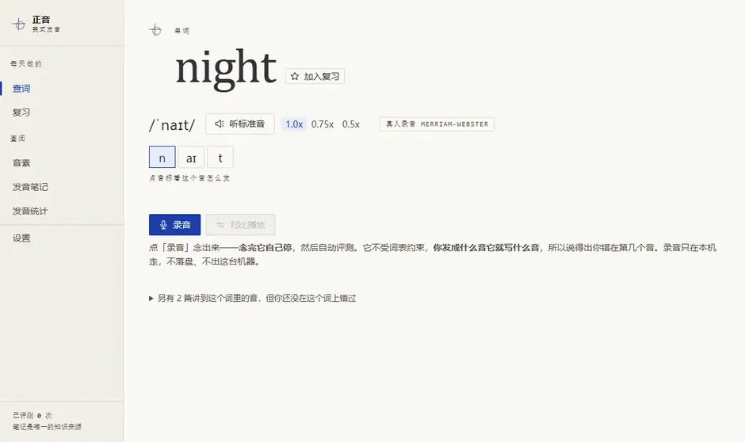
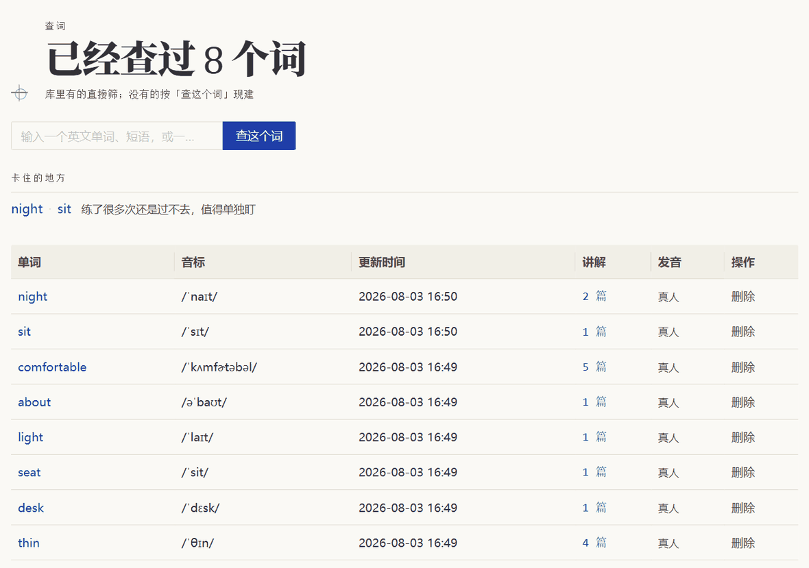
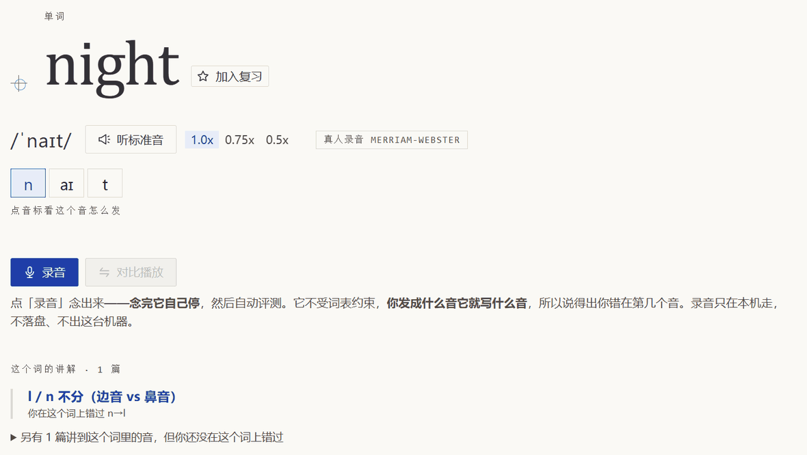

# 正音

> 中文母语者的美式发音纠正工具：逐个音素告诉你哪个念错了，全部跑在本机。

[](LICENSE) [](https://github.com/rockbenben/365opensource)

[⬇ 下载 ZIP](https://github.com/rockbenben/zhengyin/archive/refs/heads/main.zip) · [两分钟跑起来](#两分钟跑起来)



<sub>真跑出来的一遍：点「录音」→ 念完它自己停 → 它指出第一个音发成了 \[l\]，接着给出 /n/ 该怎么动舌头。</sub>

**它不给分数。**「85 分」不告诉你下一步做什么；「第一个音你发成了 /s/，舌尖要伸出来碰上门牙」告诉你。

给**中文母语者**练**美式发音**用。同类 App 多是一年上百刀的订阅，而如果你一天只纠一两个词，买一年不划算——这个装一次就一直能用。录音在你自己电脑上处理完就丢掉，不存盘也不上传；没有账号，不用联网（除了可选的词典音频）。

**装完就能用，不用 AI。** 但你手边要是有个能读写这个文件夹的 AI（跑在你电脑上的那种），它能接上第二层：工具把你每次录音的判定都攒着，AI 读得到——哪个音错得最多、哪些错反复出现却还没有讲解，它自己就能看出来，然后用中文写成 `notes/` 下的笔记。以后你再念错同一个音，页面上直接带出这篇讲解。

## 支持范围

| 方面           | 支持                                                | 需要注意                                                                     |
| -------------- | --------------------------------------------------- | ---------------------------------------------------------------------------- |
| **系统**       | Windows · macOS · Linux，各有一个双击就跑的启动文件 | 只有 Linux 没有可靠的「双击跑脚本」约定，多数桌面环境会拿编辑器打开 `.sh`    |
| **运行环境**   | Node 20.19 或更新，**唯一的前置条件**               | 更老的版本会被启动脚本拦下，并用中文说清该干什么                             |
| **逐音素评测** | `uv`（可选，装了才有），Python 3.11 起             | Python 由 `uv` 自己准备，不用你装。不装 `uv` 也能查词、听真人音、录音、A/B 对比 |
| **目标口音**   | 美式发音（General American）                        | 只按美音判，英音的 /ɑː/、非儿化 r 会被算成错                                 |
| **能查的词**   | CMUdict 收录的单词，也能整条短语一起查              | 生僻词、专有名词、缩写、俚语查不到，只能手工给一个音标                       |
| **测得了什么** | 音素层面：哪个音换了、哪个漏了、哪个多了            | 音色、时长、重音、语调**一概测不了**，它不是发音评分器                       |
| **怎么打开**   | 在这台机器上用 `localhost` 打开                     | 从局域网 IP 打开时浏览器不给麦克风，录音和评测用不了（查词、音素、笔记照常） |

**没有在线 Demo。** 整个工具跑在你自己电脑上，没有服务器可以放一个给你点。想先看看长什么样，这一页的几张截图就是实际界面；装起来大概两分钟。它测不了什么，都写在[局限性](#局限性)。

## 功能

- **逐音素判定**：41 个美式音素，说得出你实际发了什么音，而不是「在给定的几个词里你更像哪个」
- **真人发音 + A/B 对播**：你的录音和标准音都剪过静音，挨在一起听
- **有终点的复习队列**：只收真念错过的词，连对两次才升档，爬到顶就毕业出列
- **发音统计**：错误按发音部位铺成矩阵，看得出「四个毛病其实是同一个部位」
- **41 个音素摆成两张格子**：辅音按部位 × 方式、元音按高低 × 前后，一眼看得出 l 和 n 只差气流走哪儿；每个音还有自己的一页

---

## 两分钟跑起来

> **只需要 Node 20.19 或更新**（[nodejs.org](https://nodejs.org) 下 LTS，一路下一步）。版本太老或者没装，启动窗口会用中文说清该干什么，不会甩你一屏英文报错。不用注册，不用填 key。

### 1. 下载

这一页顶上绿色的 **Code → Download ZIP**，解压到一个你找得到的地方（别放在「下载」文件夹里——练习记录会存在这个文件夹内部，误删就没了）。用 git 的话 `git clone https://github.com/rockbenben/zhengyin.git` 也一样。

### 2. 双击启动

按你的系统双击对应那个文件，别的什么都不用做：

| 系统    | 开启                            | 关闭           |
| ------- | ------------------------------- | -------------- |
| Windows | `启动.cmd`                      | `停止.cmd`     |
| macOS   | `启动.command`                  | `停止.command` |
| Linux   | `启动.sh`（多一步，见本节末尾） | `停止.sh`      |

第一次会自动装依赖并构建（一两分钟，只有这一次），之后每次几秒。**浏览器自己打开**，不用记网址。习惯终端的话一条命令等价：`npm run go`。

### 3. 查一个词，然后念一遍

首页输入框里打一个英文单词或短语，按「查这个词」。音标、真人发音、可点的音素条立刻就配好了。**不知道从哪开始**：输入框正下方就有六个起步词，每个盯住中文母语者的一个典型坑（`desk` 音节尾辅音、`seat` 长短元音、`thin` 的 θ、`comfortable` 重音、`about` 弱读、`light` 的 l/n），点一下就建好。

点「录音」，念完它自己停，然后告诉你**第几个音发成了什么**。也可以跟标准音 A/B 对播（两边都剪过静音，挨在一起听）。

> 逐个音素的判定需要一个本机的 Python 服务，它由 `uv` 拉起来。没装 `uv` 的话，页面和启动窗口会当场告诉你怎么装，装完重新双击启动即可（详见 [打开逐音素评测](#打开逐音素评测)）。在那之前，上面说的都能用，只是听不到「第几个音发成了什么」这一句。

---

## 练下去会发生什么


<sub>错误按**发音部位**铺开——上图里 `n` 和 `l` 同时亮着、都在「齿龈」那一列，一眼就看得出问题不在某个字母，在舌头停的位置。每一条错都连着能点开的讲解。</sub>

- **念错的词自己进复习队列。** 只有真念错过的、和你手动点星的会进来，查过一眼的不进。**从第二天开始排**——刚加进来那天你已经念过它了。
- **复习有终点。** 间隔走 1-2-3-5-7 天，每档连对两次才往上走，到顶再连对两次就毕业出列。上限只有一周，因为练的是舌头的动作，一个月不做就散了。
- **首页告诉你今天该练什么。** 两类：练了很多次还是过不去的词，和反复错、却还没有讲解的音。每一条都配一个点进去就能开录的入口。列不下的会写一句「另外还有 N 处」指向发音统计。



<sub>没东西可练时这一块整个不出现，不会拿一屏待办挡住查词框。</sub>

- **反复出错的音会自己浮出来。**「发音统计」页按次数排；某个音错得多、而且不止在一个词上，对应的讲解会升到「录音里反复出现」那一档。
- **新写的笔记会自动认领你以前的录音。** 每次启动都按当前的 `notes/` 重算一遍归属，所以补一篇讲 /r/ 的笔记之后，你三个月前那些 /r/ 错音立刻算进它的证据里，不用重录；笔记改窄了，不该算的也会退出去。没有「重建索引」这种按钮。

---

## 常用操作

### 专攻某一个音

「音素」页把 41 个音摆成两张格子：辅音按**部位 × 方式**（舌头碰在哪儿 × 气流怎么走），元音按**高低 × 前后**。这样看得见一件平铺的列表说不出的事——`/l/` 在「边音·齿龈」、`/n/` 在「鼻音·齿龈」，同一列不同行，舌尖位置一样，只差气流走两侧还是鼻腔；捏住鼻子就能自己验证。点进任意一个音，是它自己的一页：怎么发（舌尖顶哪、气流走哪、唇形）、发音部位，以及库里含这个音的例词。在那一页就能挑一个词直接开录，不用回首页一个个查过去。评测结果里点任意一个音标，去的也是这一页。

### 让 AI 接手讲解

**在这个文件夹里开一个 AI，让它先看你的记录。** 每次评测的判定都攒在本机，工具把它汇成一张统计写进 `发音档案.md` 末尾（`/api/stats` 是同一份）：哪个音错得最多、错在哪些词上、哪些反复出现却还没有讲解、哪些词练了很多次仍然过不去。**该补哪几篇，它自己看得出来，不用你挑。**

也可以直接把某个念不准的词发给它。两种都行——它写出来的是同一样东西：`notes/` 下一篇讲清这个音怎么发、怎么自检、怎么对比练的笔记。以后这个音出现在哪个词里，那个词的页面上就会带着这篇；你再念错它，讲解会直接展开。



<sub>讲解分两档摆：排在外面的那条是**你在这个词上真错过 n→l**；只是「这个词里有这个音」的收在下面那行折叠里。</sub>

**要哪种 AI**：装在你电脑上、能读写这个文件夹的那种，上面说的才成立——它得看得见你的记录、也得写得进 `notes/`。[Claude Code](https://claude.ai/code)、Codex、Cursor 都行，约定它们都读得到（`CLAUDE.md` 和 `AGENTS.md` 是同一份）。只能在浏览器里聊天的用不了「自己看出该补哪篇」这一层，但你把词发给它、再把写好的那篇手工存进 `notes/`，页面照样认。

**还没有笔记的音，页面不会空着。** 它会显示这个音的通用发音说明（舌尖顶哪、气流走哪），并注明还没有笔记。刚装上的时候绝大多数音都是这个状态。

**自己写笔记的话，有两条容易踩**（细节在 [CLAUDE.md](CLAUDE.md)）：

- **讲音的写 `triggers:`，讲词的写 `words:`。** 混了会让一篇讲 dopamine 的笔记弹到 light / night / fine / time 上——真发生过。
- **念错了才会得到的那个音，不该当 `triggers`。** 它是错法，写 `contrasts:`。讲 θ 的那篇一度声明 `phoneme:s`，于是 yes / this / bus 全都弹出它。

### 换成真人发音（免费，两三分钟）

设置页填一个 [Merriam-Webster 词典 API key](https://dictionaryapi.com)，单词页就会放真人录音而不是合成音。

除了好听，它还让评测更准：**参考音和你的录音过的是同一个模型**，模型自己那点偏差两边一起有，减掉就没了。没配 key 也能评测，只是那时只能拿词典音标当标准，而模型转写元音时有固定的偏移，元音的判断会明显软一截（实测元音只对 15/22，辅音 41/42）。

### 打开逐音素评测

装一个 `uv`，四选一：

```
pip install uv
winget install astral-sh.uv                      # Windows
brew install uv                                  # macOS
curl -LsSf https://astral.sh/uv/install.sh | sh  # Linux / macOS
```

它会自己建虚拟环境、装依赖，需要的 Python 也由它准备（3.11 起），你不用先装 Python。装完重新双击启动。

装好 uv 之后第一次启动要下约 1.2GB 模型，有进度条，二十来秒到几分钟看网速，之后每次启动十几秒。（没装 uv 就不会有这一步，窗口里出现的是安装说明。）默认从 [ModelScope](https://modelscope.cn) 下，连不上会自动回落 HuggingFace，已经下过的不会重下。想钉死用哪个源，在 `.env` 里写 `MODEL_SOURCE=hf` 或 `modelscope`（`.env.example` 里有样板）。

### 多人共用

侧栏最下面那行「在练 · 某某」点开就能换人、添人（换用户是罕用动作，所以摆在版口那一档，不占导航的位置）。每个人有自己的练习记录、复习队列和发音档案，互不掺和；发音笔记是共享的知识库——一个人练出来的讲解，另一个人念错同一个音时照样能用上。切换是整台机器一起切：网页上换了人，AI 那头读到的也是新的人。

### 换台电脑

设置页 →「搬家」→ 导出备份（多人共用时导的是当前用户），得到一个几十 KB 的 JSON（作者那份 46 个词、96 次录音、带复习进度，实测 43 KB）。新机器上导进去就接着练。

里面只放**丢了就补不回来的**东西：查过哪些词、每次录音的判定、复习排到第几档。音频、音标、笔记归属都不带，那些在新机器上重新算一遍就有。

导入是合并，只加不减，不会覆盖你现在的记录：

| 数据     | 导入时怎么处理                                   |
| -------- | ------------------------------------------------ |
| 录音记录 | 同一个词、同一个时间戳的，库里已经有就跳过       |
| 复习进度 | 本机那张赢。刚练出来的进度不该被一份旧备份推回去 |
| 查过的词 | 谁有手工音标听谁的                               |
| 笔记归属 | 不从备份里读，导完按本机自己的 `notes/` 重算     |

### 关掉它

把启动时弹出的那个窗口关掉就全停了，连占着 1.2GB 模型的音素识别进程一起。服务起来时会在那个窗口里打一句「这个窗口开着，网页才能用；用完关掉它就是停止，也可以按 Ctrl+C」。

窗口找不着了，才需要「停止」那个脚本。它按端口找进程（30031 / 30032），不按程序名——按名字杀会把你的编辑器和别的开发服务器一起带走。

**放一个桌面图标**（Windows）：右键 `启动.cmd` →「显示更多选项」→「发送到」→「桌面快捷方式」，「停止」同理。应用的**设置**页也写着这两件事。

> **Linux 上要多一步**：三个平台里只有它没有可靠的「双击跑脚本」约定，多数桌面环境默认用编辑器打开 `.sh`。右键找「以程序运行」/「Run as a Program」，或者终端里 `./启动.sh`。想要真的能点的图标，`启动.sh` 开头的注释里写了怎么做一个 `.desktop` 项。

---

## 局限性

- **它不是发音评分器。** 只测音素层面：哪个音换了、哪个漏了、哪个多了。音色、时长、重音、语调一概测不了。
- **元音判得比辅音弱。** 拿 16 条真人录音量过：辅音 41/42 对，元音只有 15/22，低元音 6/10，而且错法定向——一律被往 /æ/ 拽。
- **配了词典 key 会好一截。** 那时参考音和你的录音过同一个模型，偏差两边抵消；没配就只能跟词典音标比。界面会标明这次走的是哪条路。
- **判「确凿的错」的门槛（0.5）来自一个很小的样本。** 低于门槛的不算错，但仍然灰着显示出来——藏起来你就不知道模型听岔过。
- **CMUdict 查不到生僻词、专有名词、缩写、俚语。** 这类词只能手工给一个 IPA，网页上没有编辑音标的界面。
- **评测靠一个本机的 Python 识别服务**（[wav2vec2 音素 CTC](https://huggingface.co/facebook/wav2vec2-lv-60-espeak-cv-ft)，30032 端口）。选它是因为它不受词表约束，能直接转写你发出的音。
- **识别服务没起时会降级到浏览器里的 [vosk](https://github.com/ccoreilly/vosk-browser)。** 它只能在你给的两个词里挑一个更像的，说不出你实际发了什么音；界面会标明是降级模式。
- **单机本地，没有网络账号、没有公网部署。**「多人共用」只是同一台机器上按名字切换身份，不是跨设备的登录系统。录音不外传是因为代码里没有上传这个功能。换电脑要靠导出备份搬过去。
- **自带的十七篇笔记是上一个使用者练出来的。** 讲解本身对照的是 Ladefoged、Prator & Robinett 那几本标准教材，但里面的例子和次数是他的录音，不是你的。

---

## 它为什么是这样

### 音素文档和发音笔记是两件事

| 名称         | 是什么                                                                      | 在哪看                             |
| ------------ | --------------------------------------------------------------------------- | ---------------------------------- |
| **音素文档** | 这个音**客观上**怎么发——舌尖顶哪、气流走哪、唇形。41 个音全有，跟谁在念无关 | 「音素」页，或单词页点任意一个音标 |
| **发音笔记** | **你自己**的问题，带自检法和对比训练                                        | 「发音笔记」页                     |

所以大部分音在很长一段时间里都只有前者，这是正常的。

### 笔记驱动一切

`notes/*.md` 里的每篇笔记，frontmatter 声明自己管哪些音（`triggers:`）或哪几个词（`words:`）。单词页把词拆成音素、打上标签，再跟所有笔记求交集——交上的就出现在这个词下面，音素条上那个音也会被标出来、点得进去。

同一份声明还驱动了别处：「这个词容易被听成哪个词」（light / night）是拿笔记里的 `phoneme:` 去 CMUdict 反查真实 minimal pair 得来的，**不是前端猜的拼写规则**。笔记是唯一的音系知识来源。

## 参考

### 文件和数据在哪里

| 路径                                                | 是什么                                                           | 删了会怎样                                                                       |
| --------------------------------------------------- | ---------------------------------------------------------------- | -------------------------------------------------------------------------------- |
| `notes/*.md`                                        | 笔记本体，**所有人共用**                                         | 唯一的知识来源，**别删**                                                         |
| `data/当前用户.txt`                                 | 一行名字：现在是谁在用，下面那几行的 `<当前用户>` 就是它         | 下次启动回落到 `data/users/` 下的第一个人                                        |
| `data/users/<当前用户>/发音档案.md`                 | **你自己**的短板汇总 + 工具写的统计                              | **别删**。第一次启动时从 `发音档案.template.md` 铺一份，不进版本库               |
| [`美音要点-中文母语者.md`](美音要点-中文母语者.md)  | **通用先验**：中文母语者统计上容易错在哪，按「影响听懂的程度」排 | 这份不会因为你念对了就改                                                         |
| `data/users/<当前用户>/review-state.json`           | 复习进度（下次到期、当前阶梯）                                   | 复习记忆清零                                                                     |
| **`data/users/<当前用户>/index.db`**                | 你查过的词 + **每一次录音的判定**                                | ⚠️ **你练过多少次、哪个音错了多少回，全在这里，没有第二份。** 删之前先导一份备份 |
| `data/audio/`、`data/models/`                       | 音频 mp3、Vosk 模型                                              | 重下就有。但删音频要**连 `index.db` 一起删**，否则补不回来                       |
| [`CLAUDE.md`](CLAUDE.md) · [`AGENTS.md`](AGENTS.md) | 给 AI 用的操作手册（怎么写笔记、triggers 词表）                  | 两个文件同一份约定——前者是 Claude Code 认的名字，后者是 Codex / Cursor 认的      |

除了 `notes/`，你的数据全都已 gitignore，不会跟着仓库跑。

### 端口和环境变量

主服务 **30031**，音素识别服务 **30032**。端口被占就在 `.env` 里写 `PORT=30041`（**不要**写成 `PORT=30041 npm start`——那是 POSIX shell 语法，Windows 的 cmd 和 PowerShell 都跑不通）。`MODEL_SOURCE=hf|modelscope` 钉死模型下载源；`NO_OPEN=1` 关掉自动开浏览器。

### 开发

技术栈：**Hono**（server，30031）+ **React 19 / Vite / antd**（web，构建后由 30031 托管）+ **better-sqlite3**（`data/users/<当前用户>/index.db`）+ **FastAPI / transformers**（音素识别服务，30032）。Node 20.19 起，Python 3.11 起。**torch 装的是 CPU 轮子**，不用显卡——单词推理实测 0.12–0.29 秒，CUDA 版要多下 ~2.5GB 还得对版本，不值。

```
npm run dev        # server 30031 + vite 5173，改代码热更新
npm run build && npm start
npm test           # Vitest（含两个包的类型检查）
```

`screenshots/social-card.png`（1280×640）是**社交预览图**：别人把仓库链接贴进微信、Slack、X 的时候显示的那张。GitHub 不会自己去仓库里找它，要在 Settings → Social preview 手动传一次。

图上那句「发成了 \[ŋ\]」是套印带下面那行小注的**原话**（`OverprintStrip.tsx` 的 `tick()`），方括号也照 `notation.ts` 的规矩：`/…/` 是目标音，`[…]` 是你实际发出的。改了措辞记得回来对一眼——图是 PNG，没有测试守得住这条。

### 笔记索引

| 音 / 词                                                | 类型            | 核心问题                                                               |
| ------------------------------------------------------ | --------------- | ---------------------------------------------------------------------- |
| [l vs n](notes/l-vs-n-边音与鼻音.md)                   | 单辅音辨音      | 舌位相同，气流走鼻腔还是舌两侧                                         |
| [ɑ vs æ](notes/ɑ-æ-两个低元音.md)                      | 元音辨音        | 舌头前后差得很远：box 的 o 不是 cat 的 a                               |
| [弱读音节要塌下去](notes/ə-元音弱化.md)                | 元音弱化        | /ə/ 是「什么都不做」的音；machine 不是「马-婶」，dopamine 中间那拍最轻 |
| [n vs ŋ](notes/n-ŋ-前后鼻音.md)                        | 单辅音辨音      | 前后鼻音：舌尖顶齿龈还是舌根顶软腭，thin 不是 thing                    |
| [click /klɪk/](notes/kl-click-辅音连缀.md)             | 辅音连缀        | /k/ 和 /l/ 之间不许加塞 /ə/                                            |
| [θ vs s](notes/θ-s-齿间擦音.md)                        | 单辅音辨音      | 舌尖必须伸出来碰上门牙，缩回去就是 /s/                                 |
| [词尾的辅音连缀](notes/ks-词尾辅音连缀.md)             | 辅音连缀        | box 不是「巴克斯」也不是 /bɑk/——两个辅音都发，中间不许有元音           |
| [词尾 -ine](notes/ine-拼写陷阱.md)                     | 拼写陷阱        | machine / routine / caffeine 读 /iːn/，不按 nine/fine 的规律外推       |
| [Dopamine Detox](notes/dopamine-detox-重音与ks收尾.md) | 重音 + 词尾连缀 | 重音都在最前；-ine 读 /iːn/ 不读 /aɪn/；/ks/ 中间不许有元音            |
| [长短元音](notes/ɪ-i-ʊ-u-长短元音.md)                  | 元音辨音        | sit 不是短一点的 seat——差在嘴角拉不拉开、嘴唇突不突，不在时长          |
| [/v/](notes/v-唇齿浊擦音.md)                           | 单辅音          | 中文里没有这个音：上牙轻咬下唇 + 喉咙震。不碰牙是 /w/，不震是 /f/      |
| [卷舌元音 ɝ/ɚ](notes/ɝ-ɚ-儿化元音.md)                  | 元音            | bird、teacher 里那一个音，不是「元音+r」两段，舌尖全程不碰东西         |
| [美音的 /r/](notes/r-美音的r.md)                       | 单辅音          | 舌尖悬空、不许有摩擦——有沙沙声就是中文的「日」                         |
| [闪音 T](notes/flap-t-闪音.md)                         | 位置变体        | water 的 t 是舌尖轻弹一下；return 的不闪（重音在后）                   |
| [词尾的暗 L](notes/dark-l-词尾的暗l.md)                | 位置变体        | feel 不是「菲欧」——舌根隆起**并且**舌尖抵住齿龈，两个动作              |
| [ʃ/ʒ/tʃ/dʒ](notes/ʃ-ʒ-tʃ-dʒ-龈后音.md)                 | 辅音组          | she 不是「西」也不是「师」——分界动作是嘴唇微微前突                     |
| [词尾的浊辅音](notes/final-voiced-词尾浊辅音.md)       | 位置变体        | bed 不是 bet——喉咙不许提前关掉；前面那个元音也要拖足                   |

（这张表是 AI 每次写完新笔记后手动维护的索引，方便直接在仓库里翻阅源文件；网页版的「发音笔记」页是同一批笔记的自动生成视图，按「录音里反复出现」和「素材库」两档分组——素材库那半再按辅音 / 元音 / 位置与连缀 / 讲某几个词的分格摆，辅音按部位从唇到喉排，攒到几十篇也翻得动。还带例词反查，两者不冲突。）

## 关于 365 开源计划

[365 开源计划](https://github.com/rockbenben/365opensource) 的第 **#031** 个项目——一个人 + AI，一年 300+ 个开源项目。

[提交你的需求 →](https://365.aishort.top/) · [Discord](https://discord.gg/PZTQfJ4GjX) · [Telegram](https://t.me/aishort_top)
